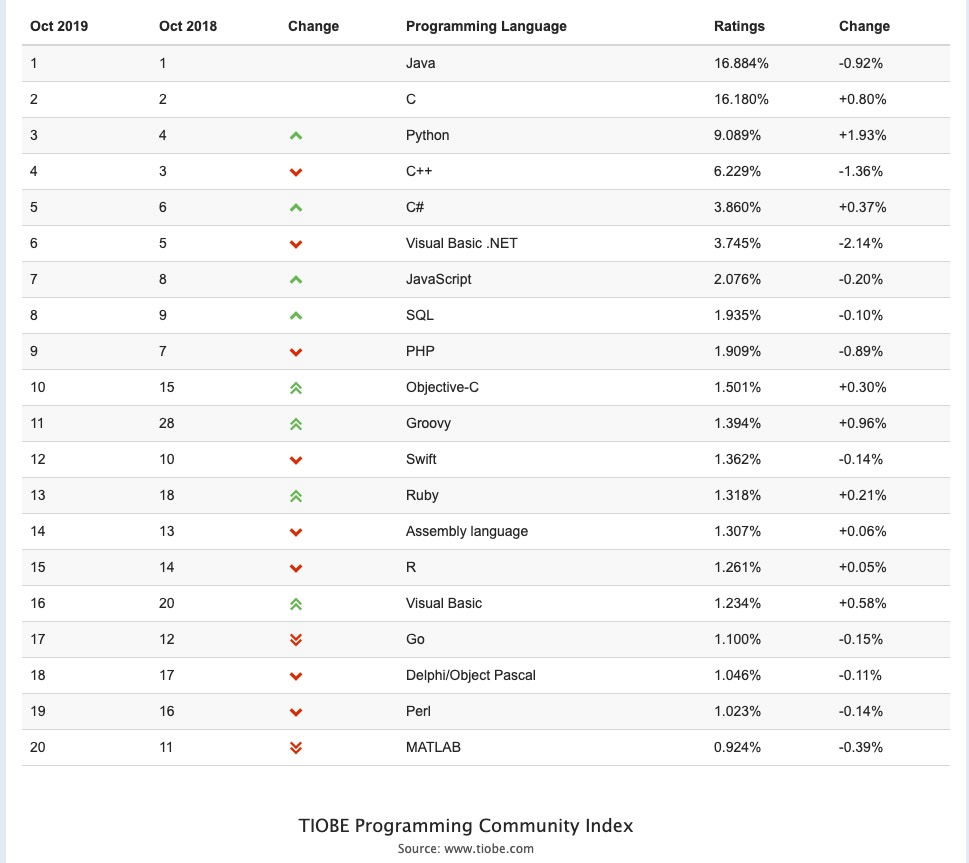

# 前台服务
前台服务提供设计师素材搜索，交流分享功能，初步估计包含以下功能
- 首页 （banner + 瀑布流展示） *
- 搜索页（按分类，业页等搜索）
- - 展示页
  1. 下载（必须登录，权限校验，精品限制以及下载次数控制） *
  2. 点赞
  3. 分享（微博）
  4. 评论（敏感词检查和脱敏处理）**
- - 素材上传（原件&封面图）
  1. 文件上传（支持拖拽）
  2. 解析图片大小*
  3. 在线裁剪（需要技术调查）**
  4. 文件类型过滤（防止恶意文件）*
  5. 支持断点续传*
- 第三方登录（需甲方提供申请材料）
  1. 微博
  2. QQ
  3. 微信
  4. 短信（需甲方购买短信服务）
- - 第三方支付（需甲方自行申请）*
  1. 支付宝
  2. 微信
- 个人中心
  1. 我的上传（未审核，已审核列出每个素材点赞数，下载数，分享数）
  2. 我的下载
  3. 充值记录
  4. 索要发票（列出用户购买记录，未开发票的可以选择索要发票，填写收件地址，其它流程由线下完成）
- 百度统计接入（查看网站pv,uv,活跃用户等信息）?
1. vip权限控制（结合会员制度）
2. 其它静态页（甲方提供）
  3.1 服务条款
  3.2 隐私协议
  3.3 关于我们

# 后台管理服务
后台管理服务提供管理人员审核，会员管理，发布活动等功能，第一期管理员帐号固定不变，或者固定手机号。初步估计包含以 下功能
- 统计页（图表展示）
  1. 统计每日新增素材量，每日下载次数总量
  2. 统计每日新增会员数，每日充值总额
- 素材管理
  1. 列出所有素材，下载量，分享量，点赞量
  2. 未审核素材可进入审核页，选择通过或否决（是否通知?）
- 会员管理
  1. 分等级列出会员等级，充值金额，到期时间，上传数量，下载数量
- 订单管理
  1. 列出所有订单信息（下单时间，支付方式，金额等信息）
  2. 列出索要发票列表（可修改状态为‘已开’/‘拒绝’）
1. vip活动，打折活动？
2. 新闻发布?
3. 评论删除?

# 文件服务***
文件服务提供图片和原件保存服务，文件服务在此项目中非常重要
- 基础功能（上传，下载，删除）
- 扩展
- 容灾

# 上线
- 搭建线上生产环境（或提供支持）
- PRE测试
- 试运行期间服务维护（一般前三月为试运行）

## 说明
此次甲方对画面效果要求很高且没有可用复用的代码，所以基本都要全新开发，增加了一定的开发成本和时间。除了画面精细外，还有一些硬核技术比如搭建文件服务，敏感词检查和脱敏处理，图片在线裁剪以及多种第三方登录和支持功能。

本次偏向选择python语言开发，权威机构[tiobe](https://www.tiobe.com/tiobe-index/)开语语言排行python升至第三位，php已经掉到第九位，选择一种上升空间大的语言对以后的扩展比较好。

文字后面带*号表示画面复杂程度或技术实现难度
文字后面带?号表示功能未定
- 文字前面带点号表示计1个点

初步估计后端21个点 + pc端样式适配25%（5.25） + 移动端样式适配15%（3.15） = 21 + 5.25 + 3.15 = 29.4
