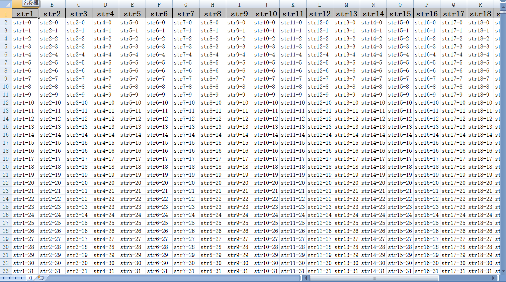
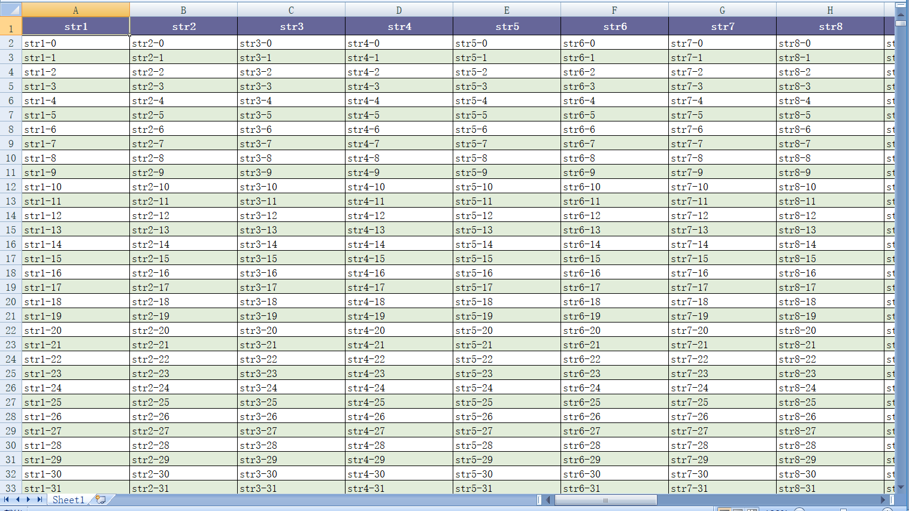

## 开始

### easyexcel

[easyexcel](https://github.com/alibaba/easyexcel)在Apache POI基础上包装而来，主要为了降低内存使用防止OOM发生，
当然使用方法比原生的POI要简结很多，github上有12.9k Star，国内应该有大量用户。

引用作者总结核心原理：
1. 文件解压、文件读取通过文件形式
2. 避免将全部全部数据一次加载到内存(采用sax模式一行一行解析并使用观察者的模式通知处理)
3. 抛弃不重要的数据(忽略样式，字体，宽度等数据)

[点击这里](https://github.com/alibaba/easyexcel/blob/master/abouteasyexcel.md)查看作者原文

### eec

[eec](https://github.com/wangguanquan/eec)并没有使用Apache POI包，事实上eec仅依懒dom4j和slf4j，前者用于小文件xml读取，后者统一日志接口。

核心原理：
1. 不缓存数据或少量缓存到内存，写文件时直接往临时文件写入
2. 单元格样式仅使用一个int来保存极大缩小内存使用
3. 采用Stream方式读取excel内容，不会将整个文件读入到内存

简单总结两个工具的不同：
- 底层不同，easyexcel底层为Apache POI，eec直接使用IO/NIO
- easyexcel简化了接口导致无法设置样式，eec可以方便设置任意样式
- easyexcel忽略样式和字体也没有办法直接获取单元格的公式。
- 数据量超过单个worksheet页时easyexcel无法自动分页，eec会分为多个worksheet保存数据

相比之下eec更接近于Apache POI，而easyexcel更关注单元格的值

## 使用方式

### 写文件

对于小文件可能直接将内容放到数组中一次完成

以下代码中`defaultTestPath`是文件路径事先已创建好。

easyexcel

```
public void test5(List<Item> data) {
    EasyExcel.write(defaultTestPath.resolve("test5.xlsx").toString(), LargeData.class).sheet().doWrite(data);
}
```



eec

```
public void test6(List<Item> data) throws IOException {
    new Workbook("test6").addSheet(new ListSheet<>(data)).writeTo(defaultTestPath);
}
```
