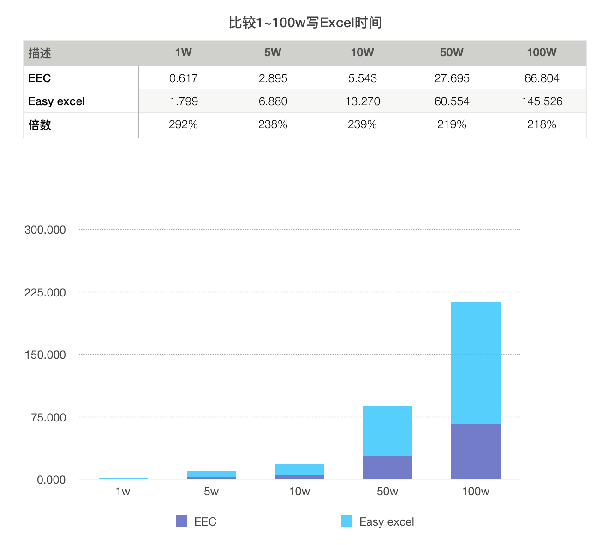
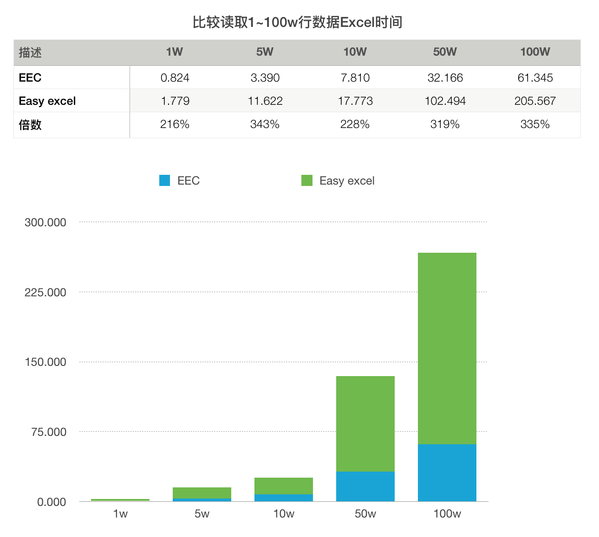
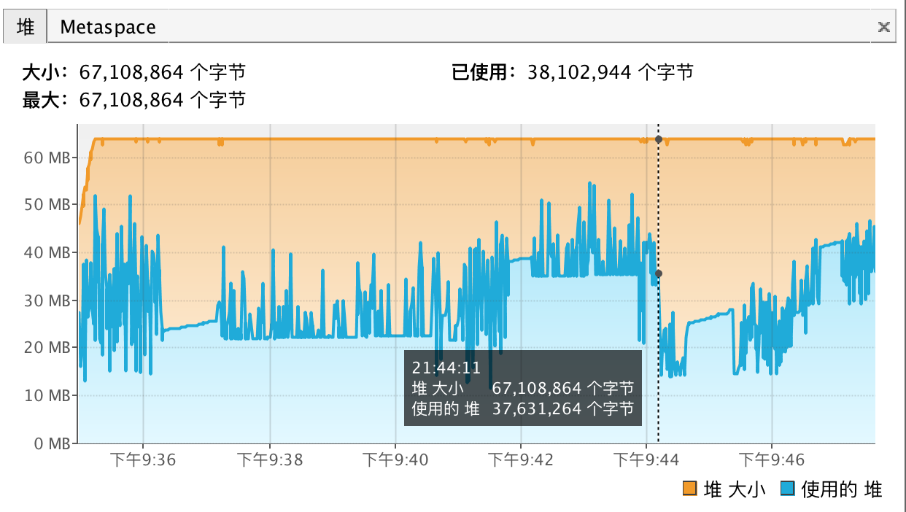

本文主要对比Excel操作的两款工具easyexcel和eec的性能和内存，以下列出测试环境

硬件:
- CPU: 2.7 GHz Intel Core i5 (双核)
- 内存: 8 GB 1867 MHz DDR3
- 硬盘: SATA 128G(35G可用)
- 系统: macOS 10.12.6

测试版本:
- easyexcel: 2.1.6
- eec: 0.4.2

为了避免内存对速度的影响，测试过程中添加jvm参数`-Xmx64m -Xms1m`，限制最大堆内存为64MB，后面会有放开内存限制的测试，这里透露一下内存不是影响速度的关键因素。

### 读写文件测试

至BIFF5以后Office就使用SharedString方式保存字符串，使用共享字符串可以达到压缩文件的目的，但是POI使用的是`innerStr`方式写字符串，easyexcel底层是POI所以自然的继承了这一方式，
eec默认也是使用innerStr方式，也可以使用注解`@ExcelColumn(share = true)`来使用SharedString方式。

测试实体为int,long,Date,double各一个加上25个字符串组成，按1000条记录进行一次分片。
下面对比两个工具分别对1w，5w, 10w, 50w, 100w数据的读写，所有测试代码已上传到github上地址[eec-poi-compares](https://github.com/wangguanquan/eec-poi-compares)

测试之前我们先进行1w~100w数据空测，模拟取数据的时间以此为基准来测试Excel读写时间。

这是测试结果截图，为了抓取jvm参数我在test100w方法里休眠了20秒钟，从测试数据上看100w空转时间为23.54秒，减去休眠的20秒实际应该是3秒。

图表展示:
1〜100w行数据写文件（时间均为秒）


读取1~100w行数据（时间均为秒）


通过上图可以简单总结: 写文件eec平均比easyexcel快1倍以上，读文件eec平均比easyexcel快约2倍左右。*注意: 这个结论只适用于配置较低的机器，并不适用于多核心SSD高配机*
easyexcel和eec均频繁进行磁盘I/O操作，所以一块好的硬盘可以极大的提升速度。

#### jvm对比

我们限制了jvm堆大小为64M，以下是运行过程中堆的波动情况，鼠标标识的位置(21:44:11)左边是easyexcel使用堆内存情况，右边是eec使用堆内存情况。
好消息是两个工具均能在64MB的限制下完成测试，easyexcel最高占用57.7MB，eec最高49.3MB略低，但我觉得这个波动在正常范围内并不能说eec使用内存比easyexcel低


*下面详细日志有准确的时间序列*

#### 文件大小对比

单位为MB，有Date类型的情况下eec比easyexcel略小，因为eec使用int值或者double值保存时间数据，使用样式格式化显示，这与Office Excel的处理方式相同，而easyexcel默认以字符串保存所以长度会大于int或double，如果全部是字符串那么会得到相反的结论

描述 | 1w | 5w | 10w | 50w | 100w
----|---:|---:|----:|----:|-----:|
EEC | 1.7 | 8.6 | 17.2 | 86.6 | 173.4
Easy excel | 1.7 | 8.7 | 17.4 | 87.7 | 175.7


### 更细节的分析

下面拿出测试过种中打印的日志进行进一步分析，日志做了一些删减方便阅读

```
2020-03-05 21:34:44.412 [LargeExcelTest:200] - Easy-excel start to write...
2020-03-05 21:34:49.922 [LargeExcelTest:206] - 0 fill success.
2020-03-05 21:35:33.660 [LargeExcelTest:206] - 500 fill success.
2020-03-05 21:36:17.902 [LargeExcelTest:206] - 999 fill success.
2020-03-05 21:37:09.910 [LargeExcelTest:209] - Easy-excel write finished. used: 145481
2020-03-05 21:37:09.911 [LargeExcelTest:226] - Easy-excel start to read...
2020-03-05 21:37:35.376 [LargeDataListener:19] - Already read:100000
2020-03-05 21:39:02.767 [LargeDataListener:19] - Already read:500000
2020-03-05 21:40:35.470 [LargeDataListener:19] - Already read:1000000
2020-03-05 21:40:35.471 [LargeDataListener:25] - Large row count:1000000
2020-03-05 21:40:35.477 [LargeExcelTest:230] - Easy-excel read finished. used: 205566

2020-03-05 21:40:35.478 [LargeExcelTest:200] - Easy-excel start to write...
2020-03-05 21:40:36.152 [LargeExcelTest:206] - 0 fill success.
2020-03-05 21:40:44.096 [LargeExcelTest:206] - 99 fill success.
2020-03-05 21:40:48.505 [LargeExcelTest:209] - Easy-excel write finished. used: 13027
2020-03-05 21:40:48.506 [LargeExcelTest:226] - Easy-excel start to read...
2020-03-05 21:41:06.279 [LargeDataListener:19] - Already read:100000
2020-03-05 21:41:06.279 [LargeDataListener:25] - Large row count:100000
2020-03-05 21:41:06.279 [LargeExcelTest:230] - Easy-excel read finished. used: 17773

2020-03-05 21:41:06.280 [LargeExcelTest:200] - Easy-excel start to write...
2020-03-05 21:41:06.443 [LargeExcelTest:206] - 0 fill success.
2020-03-05 21:41:07.378 [LargeExcelTest:206] - 9 fill success.
2020-03-05 21:41:08.078 [LargeExcelTest:209] - Easy-excel write finished. used: 1798
2020-03-05 21:41:08.078 [LargeExcelTest:226] - Easy-excel start to read...
2020-03-05 21:41:09.856 [LargeDataListener:25] - Large row count:10000
2020-03-05 21:41:09.857 [LargeExcelTest:230] - Easy-excel read finished. used: 1779

2020-03-05 21:41:09.857 [LargeExcelTest:200] - Easy-excel start to write...
2020-03-05 21:41:10.050 [LargeExcelTest:206] - 0 fill success.
2020-03-05 21:41:47.237 [LargeExcelTest:206] - 499 fill success.
2020-03-05 21:42:10.411 [LargeExcelTest:209] - Easy-excel write finished. used: 60554
2020-03-05 21:42:10.411 [LargeExcelTest:226] - Easy-excel start to read...
2020-03-05 21:42:29.944 [LargeDataListener:19] - Already read:100000
2020-03-05 21:43:52.905 [LargeDataListener:19] - Already read:500000
2020-03-05 21:43:52.905 [LargeDataListener:25] - Large row count:500000
2020-03-05 21:43:52.905 [LargeExcelTest:230] - Easy-excel read finished. used: 102494

2020-03-05 21:43:52.906 [LargeExcelTest:200] - Easy-excel start to write...
2020-03-05 21:43:53.027 [LargeExcelTest:206] - 0 fill success.
2020-03-05 21:43:57.199 [LargeExcelTest:206] - 49 fill success.
2020-03-05 21:43:59.785 [LargeExcelTest:209] - Easy-excel write finished. used: 6879
2020-03-05 21:43:59.785 [LargeExcelTest:226] - Easy-excel start to read...
2020-03-05 21:44:11.407 [LargeDataListener:25] - Large row count:50000
2020-03-05 21:44:11.407 [LargeExcelTest:230] - Easy-excel read finished. used: 11622


2020-03-05 21:44:11.408 [LargeExcelTest:213] - EEC start to write...
2020-03-05 21:44:11.765 [LargeExcelTest$1:218] - 0 fill success.
2020-03-05 21:44:25.623 [LargeExcelTest$1:218] - 500 fill success.
2020-03-05 21:44:38.838 [LargeExcelTest$1:218] - 1000 fill success.
2020-03-05 21:45:18.211 [LargeExcelTest:222] - EEC write finished. used: 66803
2020-03-05 21:45:18.212 [LargeExcelTest:234] - EEC start to read...
2020-03-05 21:45:27.765 [LargeExcelTest:238] - Worksheet [Sheet1] dimension: A1:AC1000001
2020-03-05 21:45:32.812 [LargeExcelTest:242] - Reading 100000 rows
2020-03-05 21:46:19.416 [LargeExcelTest:242] - Reading 1000000 rows
2020-03-05 21:46:19.417 [LargeExcelTest:246] - Data rows: 1000000
2020-03-05 21:46:19.556 [LargeExcelTest:250] - EEC read finished. used: 61343

2020-03-05 21:46:19.556 [LargeExcelTest:213] - EEC start to write...
2020-03-05 21:46:19.577 [LargeExcelTest$1:218] - 0 fill success.
2020-03-05 21:46:21.700 [LargeExcelTest$1:218] - 100 fill success.
2020-03-05 21:46:25.099 [LargeExcelTest:222] - EEC write finished. used: 5543
2020-03-05 21:46:25.100 [LargeExcelTest:234] - EEC start to read...
2020-03-05 21:46:26.173 [LargeExcelTest:238] - Worksheet [Sheet1] dimension: A1:AC100001
2020-03-05 21:46:32.164 [LargeExcelTest:242] - Reading 100000 rows
2020-03-05 21:46:32.164 [LargeExcelTest:246] - Data rows: 100000
2020-03-05 21:46:32.180 [LargeExcelTest:250] - EEC read finished. used: 7080

2020-03-05 21:46:32.181 [LargeExcelTest:213] - EEC start to write...
2020-03-05 21:46:32.208 [LargeExcelTest$1:218] - 0 fill success.
2020-03-05 21:46:32.433 [LargeExcelTest$1:218] - 10 fill success.
2020-03-05 21:46:32.797 [LargeExcelTest:222] - EEC write finished. used: 616
2020-03-05 21:46:32.798 [LargeExcelTest:234] - EEC start to read...
2020-03-05 21:46:32.955 [LargeExcelTest:238] - Worksheet [Sheet1] dimension: A1:AC10001
2020-03-05 21:46:33.618 [LargeExcelTest:246] - Data rows: 10000
2020-03-05 21:46:33.622 [LargeExcelTest:250] - EEC read finished. used: 824

2020-03-05 21:46:33.622 [LargeExcelTest:213] - EEC start to write...
2020-03-05 21:46:33.633 [LargeExcelTest$1:218] - 0 fill success.
2020-03-05 21:46:44.500 [LargeExcelTest$1:218] - 500 fill success.
2020-03-05 21:47:01.316 [LargeExcelTest:222] - EEC write finished. used: 27694
2020-03-05 21:47:01.317 [LargeExcelTest:234] - EEC start to read...
2020-03-05 21:47:06.141 [LargeExcelTest:238] - Worksheet [Sheet1] dimension: A1:AC500001
2020-03-05 21:47:11.514 [LargeExcelTest:242] - Reading 100000 rows
2020-03-05 21:47:33.398 [LargeExcelTest:242] - Reading 500000 rows
2020-03-05 21:47:33.398 [LargeExcelTest:246] - Data rows: 500000
2020-03-05 21:47:33.483 [LargeExcelTest:250] - EEC read finished. used: 32165

2020-03-05 21:47:33.483 [LargeExcelTest:213] - EEC start to write...
2020-03-05 21:47:33.489 [LargeExcelTest$1:218] - 0 fill success.
2020-03-05 21:47:34.601 [LargeExcelTest$1:218] - 50 fill success.
2020-03-05 21:47:36.378 [LargeExcelTest:222] - EEC write finished. used: 2895
2020-03-05 21:47:36.378 [LargeExcelTest:234] - EEC start to read...
2020-03-05 21:47:36.928 [LargeExcelTest:238] - Worksheet [Sheet1] dimension: A1:AC50001
2020-03-05 21:47:39.760 [LargeExcelTest:246] - Data rows: 50000
2020-03-05 21:47:39.768 [LargeExcelTest:250] - EEC read finished. used: 3389
```

我们看到easyexcel从21:34:44.412开始到21:36:17.902写完100w数据，再到21:37:09.910完成数据压缩，写数据用时93.49秒，压缩用时52.008秒
而eec写100w用时27.43秒(实际比这个大一点，因为eec使用pull方式拉数据，我们无法知道最后一批数据完成的实际时间)，压缩用了39.373秒(实际比这个小一点)

我们进一步列出所有写操作的写数据时间和压缩时间

描述 | 1w | 5w | 10w | 50w | 100w
----|---:|---:|----:|----:|-----:|
EEC写数据 | 0.252 | 1.118 | 2.144 | 10.867 | 27.43
EEC压缩数据 | 0.364 | 1.777 | 3.399 | 16.816 | 39.373
Easy excel写数据 | 0.935 | 4.172 | 7.944 | 37.38 | 93.49
Easy excel压缩数据 | 0.7 | 2.586 | 4.409 | 23.174 | 52.008

上图可以发现eec写数据的速度远大于easy excel，平均超过3倍多。


### Office默认的字符串Shared模式读性能对比

由于easyexcel并不支持字符串Shared写入，所以测试文件由eec产生，然后两种工具读取相同文件，内存同样限制在64MB内。

直接上对比图：
# TODO

## 性能较好的机器上测试

硬件:
- CPU: 3 GHz Intel Core i5 (6核)
- 内存: 16 GB 3000 MHz DDR4
- 硬盘: Samsung SSD 970 PRO 512GB（267G可用）
- 系统: macOS 10.14.4

测试代码与上面的完全一样，所以这里不写细节直接上最终的对比图。

### 限制内存64MB测试


### 不限制内存测试


